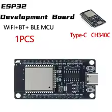
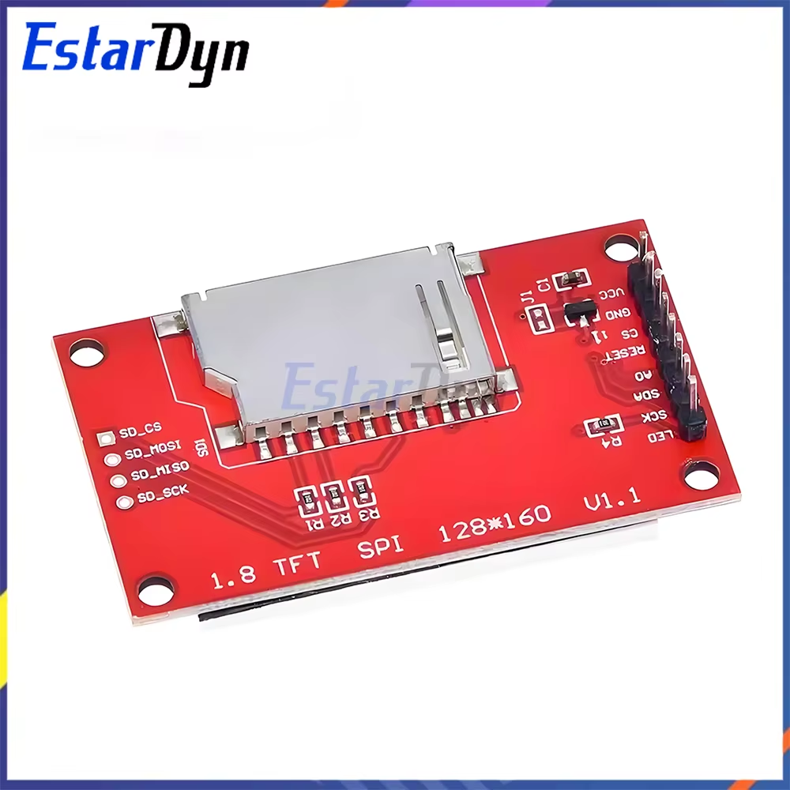
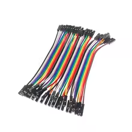
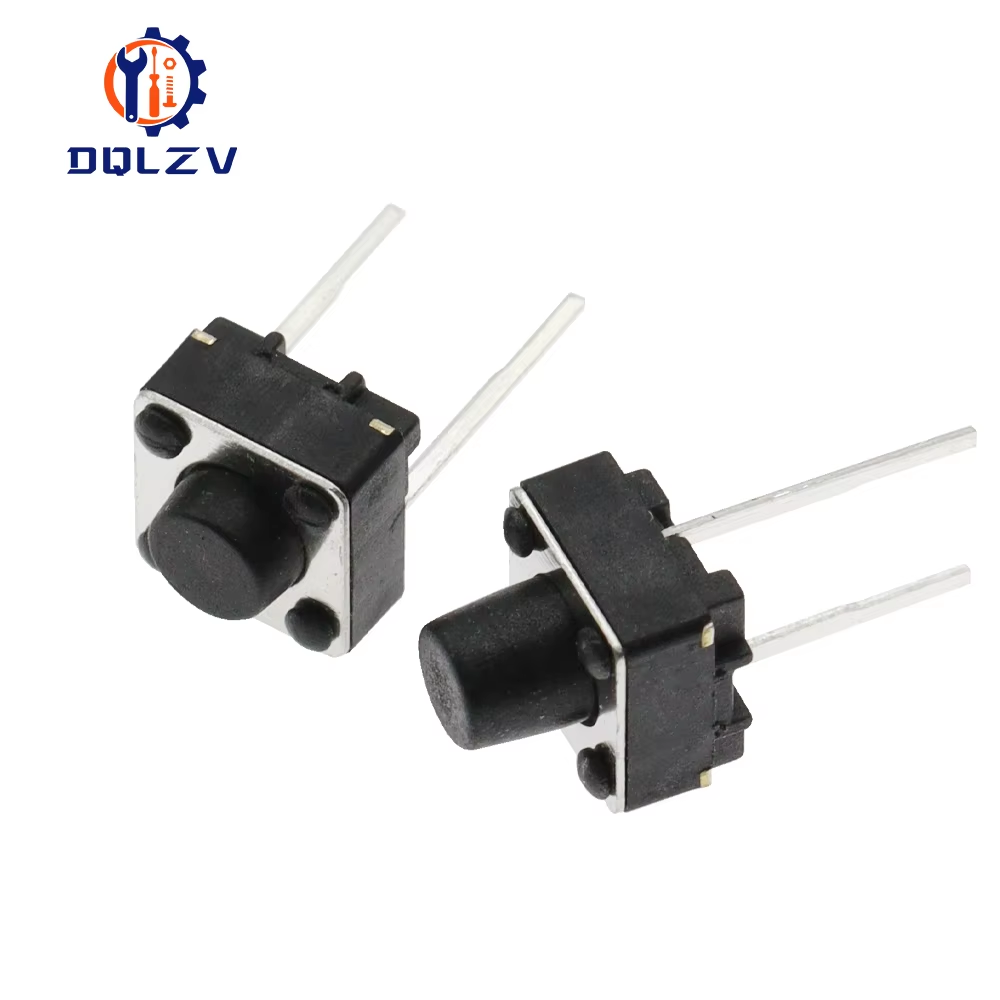
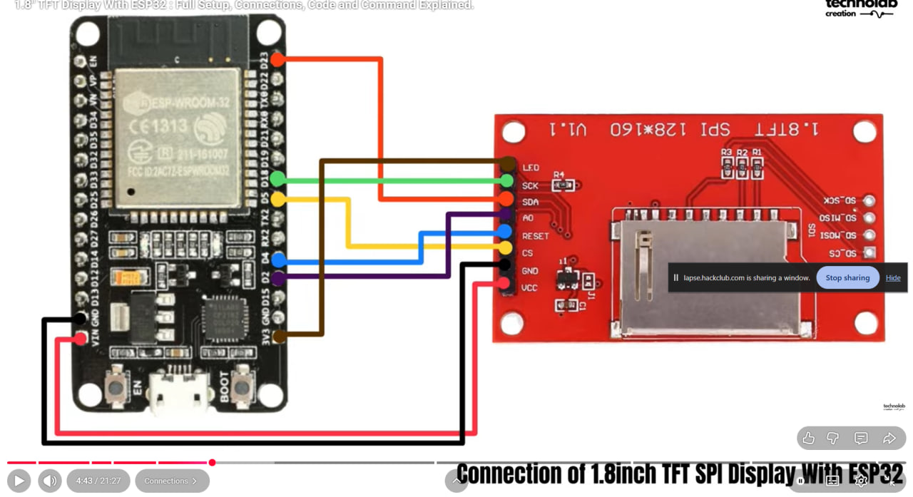
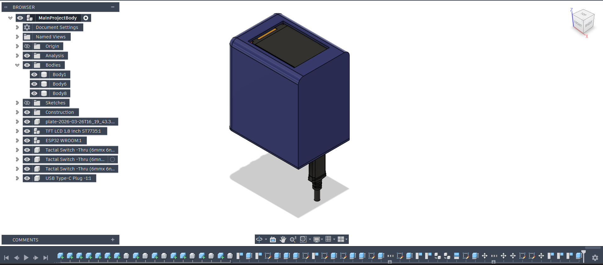
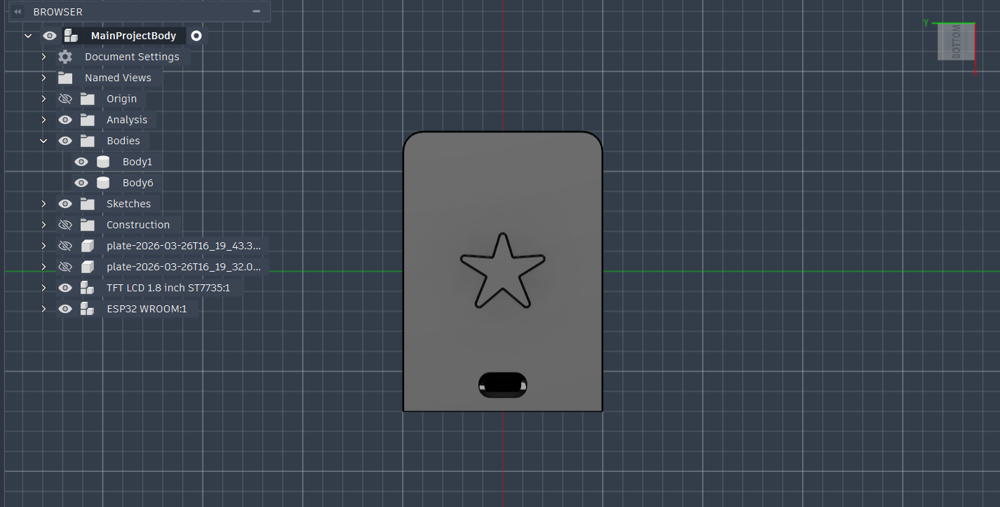
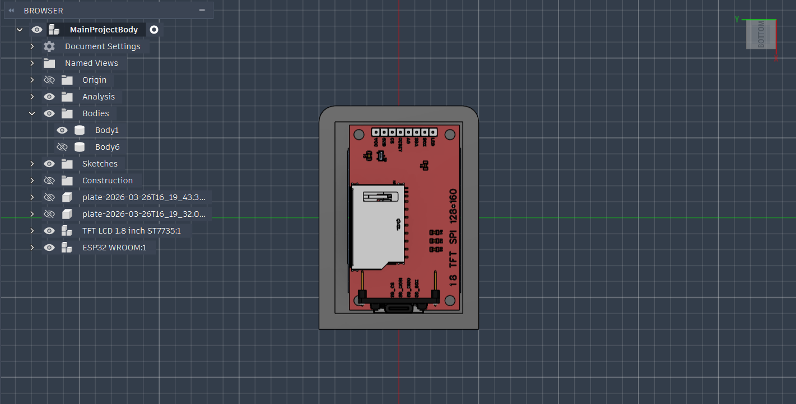
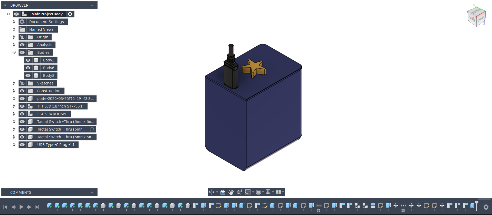

# Party Display

---

## What is this project?

**Party Display** is a hardware-based music project built using an ESP32 and a 1.8" TFT screen.

## What does it do?

It connects to the Spotify API and allows you to control the music you're currently listening to.   

## Why does it exist?

This project gives you a **dedicated physical device** to interact with your music.

I created it as a way to kick off my journey into hardware development.  
Spotify now actually *feels physical* — using real buttons is far more engaging than tapping digital ones on a screen.

---

## 🔧 Components

### ESP32 Microcontroller  
Handles backend logic such as Wi-Fi communication and Spotify API integration.  

---

### 1.8" TFT Display  
Displays song information, themes, and a progress bar.  

---

### Dupont Cables (Female-to-Female)  
Used to connect all components together (ESP32 and TFT both use male pins).  

---

### Buttons (x3)  
Used for playback control:
- Next track  
- Previous track  
- Play / Pause  

---

## Wiring

---

## CAD Design

  
  
  

---

## Future Improvements

- I am planning to add volume control  
- Display album artwork (optional)  
- Improve case design