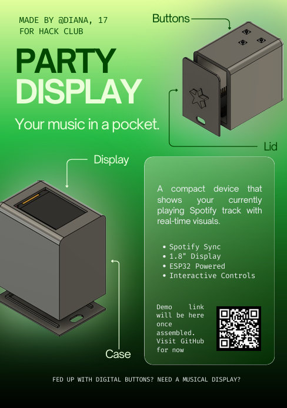

# Party Display 2.0

---

## What is this project?

**Party Display** is a hardware-based music project built using an ESP32 and a 1.8" TFT screen.

## What does it do?

It connects to the Spotify API and allows you to control the music you're currently listening to.   

## Why does it exist?

This project gives you a **dedicated physical device** to interact with your music.

I created it as a way to kick off my journey into hardware development.  
Spotify now actually *feels physical* — using real buttons is far more engaging than tapping digital ones on a screen.

## What is new in version 2.0?
The star was separated from the lid to ensure more stable 3D printing. A USB-C plug was added to the full assembly, and the hole in the lid was enlarged to incorporate all variations of the cable. Additional file formats (including .f3d) were exported, and the case was colored using the Appearances tool. Added more button functionality. 
Introduced a new, simple, yet reliable locking mechanism to secure the lid in place.

---

## Components (Refer to Bill of Materials)

### ESP32 Microcontroller  
Handles backend logic such as Wi-Fi communication and Spotify API integration.  

---

### 1.8" TFT Display  
Displays song information, themes, and a progress bar.  

---

### Dupont Cables (Female-to-Female)  
Used to connect all components together (ESP32 and TFT both use male pins).  

---

### Buttons (x3)  
Used for playback control:
- Next track  
- Previous track  
- Play / Pause  

---

## Assembly Instructions

1. Insert the display into the case, ensuring it aligns with the frame, and secure it with glue.
2. Flash the ESP32 using the script found [here](Arduino/ardsetting/ardsetting.ino).
3. Connect the ESP32 pins as follows:
 - Buttons:

   Play/Pause : GPIO 11
   
   Next : GPIO 10
   
   Previous :  GPIO 9
   
 
 - Display:
   Connect as shown in the Wiring section below.
4. Insert the buttons into their respective holes and secure them.
5. Position the ESP32 as illustrated in the assembly diagram.
6. Attach the star to the lid (cover).
7. Snap the lid onto the main body to close the case.
8. Secure the lid in place using the decorative rod with length of 12.5 mm and diameter of 3.1 mm.

---
## Wiring

---

## CAD Design

  
  
  

---

## Future Improvements

- I am planning to add volume control  
- Display album artwork (maybe?)  
- Explore better fixation options